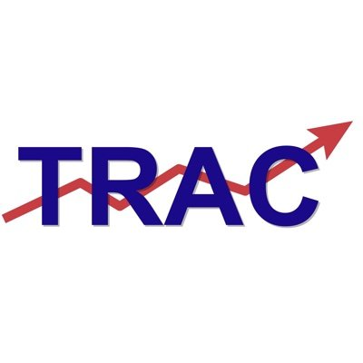

# FOIA Data Verification
This repository will contain information for verifying data received from FOIA requests. This information would be most helpful for requests received from the Department of Homeland Security. This guide will also discuss the data tools in the Transactional Records Access Clearinghouse (TRAC) and how those may be useful in the verification process. In addition, a glossary will describe commonly used terms in FOIA documents and how to interpret them.

## What is FOIA
FOIA, which stands for the Freedom of Information Act, is a law that promotes government transparency through releasing records to the public. FOIA was established in 1967 and allows citizens to request information they believe should be public from government agencies. Government agencies are required to release requested information unless it is exempt through nine categories such as national security or privacy. Most FOIA requests are now made online by individuals or corporations.   

## What is TRAC

The Transactional Records Access Clearinghouse (TRAC) is a research institute at Syracuse University that uses Freedom of Information Act requests and litigation to study the federal government. TRAC works to make federal government data and records more accessible for public view. Through FOIA requests, TRAC obtains data concerning several government agencies, with a concentration on immigration data. After receiving records, TRAC works to verify data and release it in formats that are easily understandable including graphs, tables, and data tools.

The purpose of this work is to give individuals a better view at how the federal government is operating. TRAC works to break down what is happening in the day-to-day function of government. For example, what new laws are being enacted? How many detainees are in the custody of Immigrations and Customs Enforcement? What threats face our country and how are agencies handling them? TRAC works to inform users of all of these and more. TRAC's website can be reached at this link: https://trac.syr.edu/

TRAC also runs the FOIA project, a seperate initiave to track FOIA litigation and request statuses. The FOIA project provides information about litigation concerning who acts as litigants, appeals that have been made, as well as data tools to monitor numbers surrounding FOIA requests. The FOIA Project can be found at this link: https://foiaproject.org/.

What is the need for verifying data?
Data validation is important in many aspects for the FOIA process. First, users should verify the data received in FOIA requests to make sure it is current and accurate. The point of making a FOIA request is to gain access to information which was once private, and users hope that this data will be correct. Accuracy is the goal of the FOIA request process and validation ensures that our rights to FOIA access are being fulfilled. 
Second, data from the Department of Homeland Security and specifically ICE are often incorrect or out of date. Verifying the data is the best way to ensure that what you receive is correct as to not educate with misinformation.

## Table of Contents
If you are unsure where to start in the process of verification, follow along through the sections of this table in order. There are links that will lead you through the content. You are also able to start by clicking on a section if that is what you are looking for. All files related to validation can be found below or in the [FILES RELATED TO VALIDATION](FILES_RELATED_TO_VALIDATION) folder. 

1. [Essential Materials for Validation](FILES_RELATED_TO_VALIDATION/Essential_Materials_for_Validation.md)

2. [Glossary](FILES_RELATED_TO_VALIDATION/Glossary.md)

3. [Validation Level 1](FILES_RELATED_TO_VALIDATION/Validation_Level_1.md)

4. [Internal Validation](FILES_RELATED_TO_VALIDATION/Internal_Validation.md)

5. [External Validation](FILES_RELATED_TO_VALIDATION/External_Validation%20.md)

6. [Appeals Process](FILES_RELATED_TO_VALIDATION/Appeals_Process.md)

7. [FOIA and GitHub Resources](FILES_RELATED_TO_VALIDATION/FOIA_and_GitHub_Resources.md)

